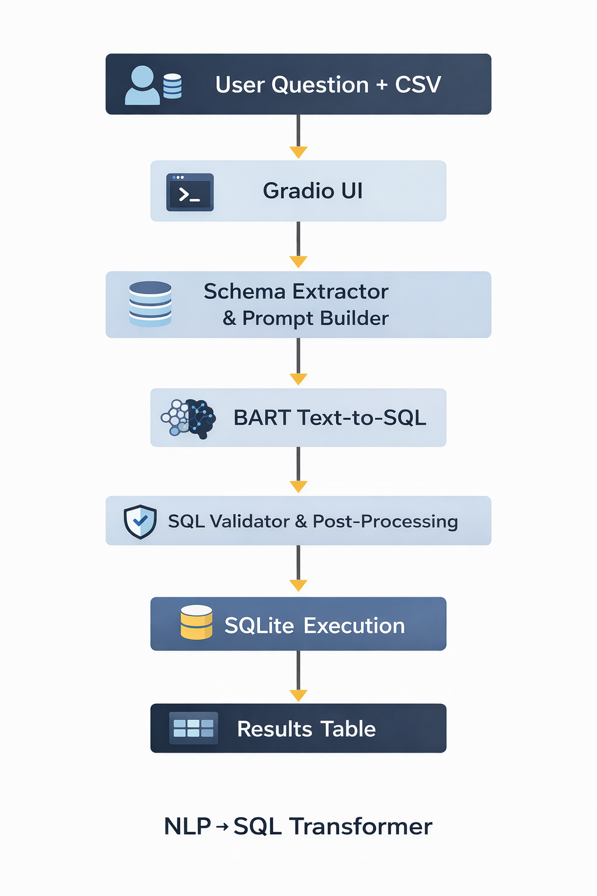

# NLP-to-SQL Transformer

> BART-based transformer that translates natural-language questions into executable SQL over user-uploaded CSV files.

[](https://huggingface.co/spaces/Rushikesh-S-Ware/NLP-SQL-Transformer)
[](https://www.python.org/)
[](https://pytorch.org/)
[](LICENSE)

---

## Problem

Business users can't write SQL but need to query their data. Off-the-shelf LLMs hallucinate column names and produce non-executable queries on unseen schemas.

## Approach

Fine-tuned `facebook/bart-base` on the **Spider** cross-domain text-to-SQL benchmark with schema-aware prompting and entity resolution. Inference optimized via ONNX export.

## Results

| Metric | Value |
|---|---|
| Spider exact-match accuracy | **45.6%** |
| Inference latency (ONNX vs PyTorch) | **60% faster** |
| Live demo response time | < 200 ms |

## Architecture



1. User uploads one or more CSV files → loaded into in-memory SQLite.
2. Schema is serialized and prepended to the user question.
3. Fine-tuned BART generates the SQL query.
4. Post-processing: regex correction, fuzzy matching for column names.
5. Query executes against SQLite; result returned as a table.

## Tech Stack

- **Model:** BART-base, fine-tuned on Spider
- **Serving:** FastAPI + Gradio on Hugging Face Spaces
- **Optimization:** ONNX runtime (60% speedup vs PyTorch baseline)
- **Data:** Spider benchmark + user-uploaded CSVs

## Quickstart

```bash
git clone https://github.com/Rushikesh-S-Ware/nlp-sql-transformer
cd nlp-sql-transformer
pip install -r requirements.txt
python src/app.py
```

Open `http://localhost:7860` and upload a CSV.

## Live Demo

👉 https://huggingface.co/spaces/Rushikesh-S-Ware/NLP-SQL-Transformer

## Repository Layout

| Path | Purpose |
|---|---|
| `src/` | FastAPI server + inference pipeline |
| `tests/` | Unit and integration tests |
| `.github/workflows/` | CI: lint, test, build |
| `Model_Training.ipynb` | Fine-tuning pipeline on Spider |
| `Demo_Notebook.ipynb` | Usage examples |
| `Model_Checkpoint/` | Fine-tuned weights |
| `requirements.txt` | Dependencies |
| `.env.example` | Required environment variables |

## License

MIT
